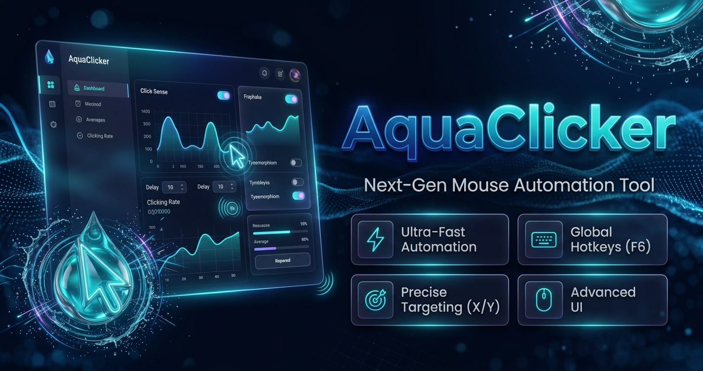

<div align="center">



# 🌊 AquaClicker

**Fast, Lightweight & Intuitive Auto Clicker for Windows & Linux**

[](LICENSE)
[](#)
[](#)
[](#)

*Automate repetitive clicks seamlessly with ultra-low latency and custom hotkeys.*

---

[Features](#-key-features) • [Installation](#-installation) • [Quick Start](#-quick-start) • [Security](#-security) • [Contributing](#-contributing)

</div>

## 💡 Key Features

* **⚡ Ultra-Fast Performance:** Low CPU and memory consumption.
* **🎯 Precision Click Modes:** Single, double, and continuous hold modes.
* **⏱ Flexible Intervals:** Set custom delays down to milliseconds.
* **⌨ Global Hotkeys:** Start and stop automation instantly with customizable shortcuts.
* **🖱 Target Selector:** Lock clicks to specific coordinates or current cursor location.
* **🎨 Clean Aqua UI:** Modern, dark-mode friendly desktop interface.

---

## 🚀 Installation

### Windows (Executable)
1. Download the latest `.exe` from the [landing](https://spiralmotorman.github.io/AquaClicker/) page.
2. Run the application (no installation required).

### Building from Source
```bash
# Clone the repository
git clone https://github.com/SpiralMotorman/AquaClicker.git

# Navigate to project directory
cd AquaClicker

# Install dependencies & run (example for Python)
pip install -r requirements.txt
python main.py
```

---

## 📖 Quick Start

1. **Select Click Interval:** Define delay hours, minutes, seconds, or milliseconds.
2. **Choose Mouse Button:** Left, Right, or Middle click.
3. **Pick Target Location:** Select "Current Location" or pick specific screen X/Y coordinates.
4. **Press Hotkey:** Press `F6` (default) to toggle activation.

---

## 🛡 Security & Fair Play

AquaClicker is designed strictly for accessibility, desktop automation, and repetitive administrative tasks. Please refer to our [Security Policy](SECURITY.md) for details on safety and anti-virus false-positive guidelines.

---

## 🤝 Contributing

Contributions make the open-source community an amazing place to learn, inspire, and create. Check out our [Contributing Guidelines](CONTRIBUTING.md) to get started.

---

## 📄 License

Distributed under the MIT License. See `LICENSE` for more information.
